# Laporan Praktikum Pemprogaman Mobile Pertemuan 3 #

### Pengenalan Core Component dan Styling ###

## 🎯 Tujuan Pembelajaran

Setelah menyelesaikan praktikum ini, mahasiswa mampu:

1. Memahami dan menggunakan **16 Core Components** React Native
2. Menerapkan **StyleSheet** untuk styling terpusat
3. Menggunakan **useState** untuk state management dasar
4. Membuat layout yang responsif dengan **Flexbox**
5. Menangani **interaksi pengguna** (tekan, input, scroll)

Langkah 1: Mengimpor Component

1. Buka file app.js pada folder projek ptmn2
2. Import 16 core component sebagai berikut:
3. Konfirmasi Bukti
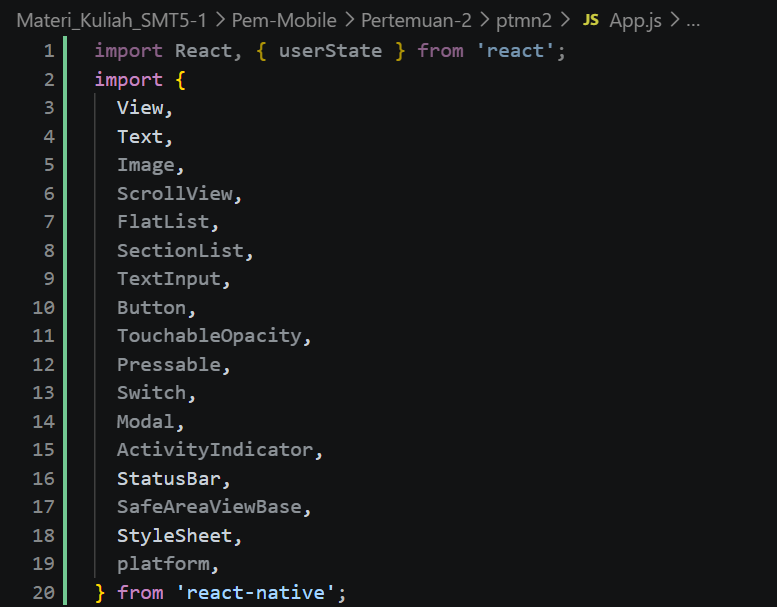

Langkah 2: Menyiapkan data Objek dan Array
1. Membuat Objek untuk menyimpan data profile
2. Buat Objek Array bernama Profile
3. Konfirmasi Bukti
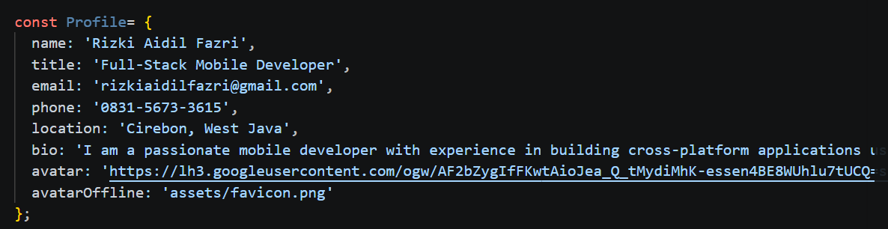
4. Membuat Objek Array bernama SKILLSS untuk menyimpan data SKILLSS
5. Buat Objek 
5. Konfirmasi Bukti
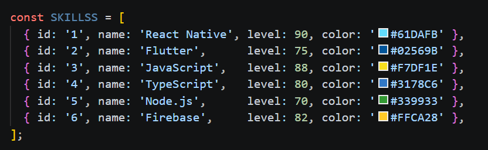
6. Membuat Objek Array SECTIONS untuk menyimpan Riwayat Pekerjaan
7. Membuat Objek Array SOCIAL untuk menyimpan Media Sosial
8. Konfirmasi Bukti SECTIONS
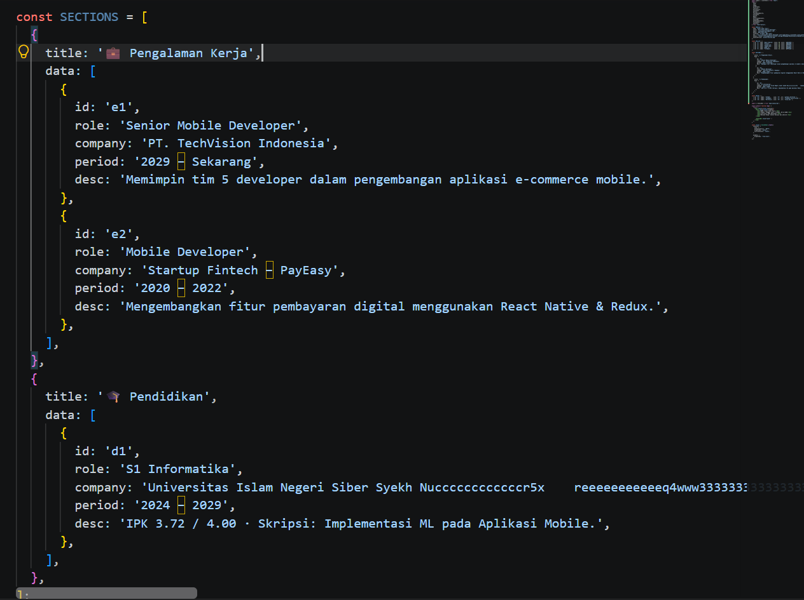
9. Konfirmasi Bukti SOCIAL

Langkah 3: Sub-Components (SkillCard & TimelineCard)
1. Membuat sub-component SkillCard untuk menampilkan satu item skill beserta progress bar
2. Membuat sub-component TimelineCard untuk menampilkan satu item riwayat pekerjaan atau pendidikan
3. Kedua komponen ditempatkan di antara data dan fungsi App()
4. Konfirmasi Bukti
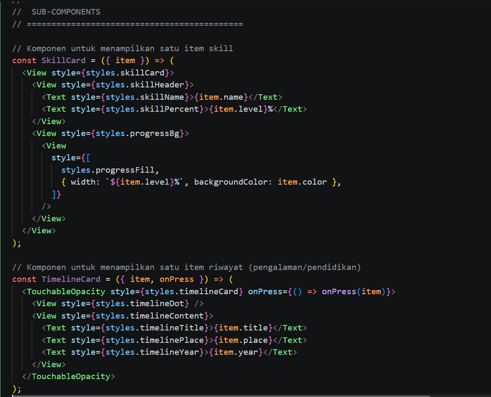

Langkah 4: State Management dengan useState
1. Menambahkan state openToWork untuk menyimpan status ketersediaan kerja pada Switch
2. Menambahkan state selectedItem dan modalVisible untuk mengontrol tampilan Modal
3. Menambahkan state senderName dan message untuk menyimpan nilai input form kontak
4. Menambahkan state sending untuk mengontrol tampilan ActivityIndicator saat proses pengiriman
5. Menambahkan state pressing untuk mendeteksi status tekan pada komponen Pressable
6. Membuat handler function handleCardPress yang dipanggil saat kartu timeline ditekan untuk menyimpan item yang dipilih dan menampilkan modal
7. Membuat handler function handleSend yang dipanggil saat tombol "Kirim Pesan" ditekan, berisi validasi input, simulasi delay 2 detik, dan alert hasil pengiriman
8. Konfirmasi Bukti
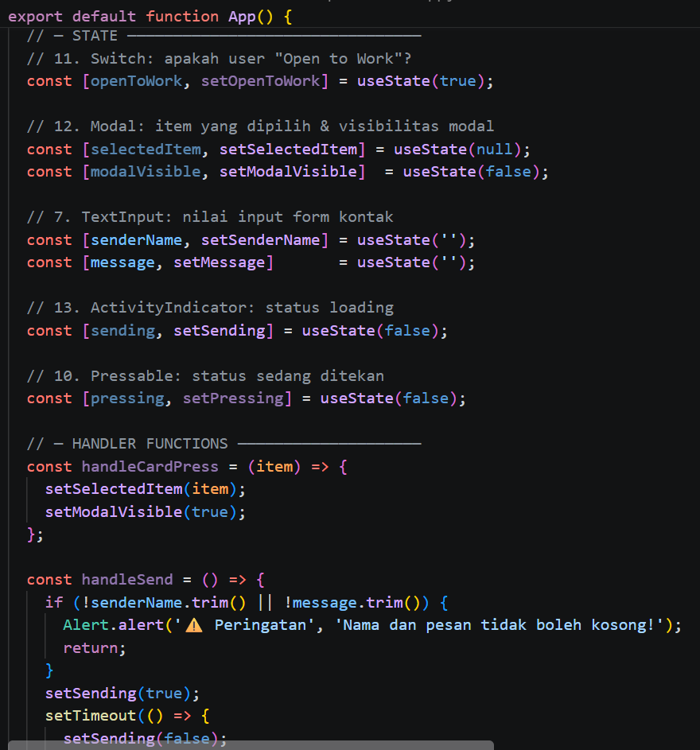

Langkah 5: SafeAreaView, StatusBar & Header
1. Mengganti return (...) pada fungsi App() dengan struktur baru menggunakan SafeAreaView sebagai wrapper utama agar konten tidak tertutup notch atau home indicator
2. Menambahkan StatusBar dengan barStyle="light-content" dan backgroundColor="#1a1a2e" untuk mengatur tampilan status bar perangkat
3. Membuat Header Bar menggunakan View dengan flexDirection: 'row' agar konten tersusun horizontal
4. Menambahkan teks judul "My CV" dan subjudul "Portfolio App" di sisi kiri header
5. Menambahkan komponen Switch di sisi kanan header yang terhubung dengan state openToWork untuk menampilkan status ketersediaan kerja
6. Konfirmasi Bukti
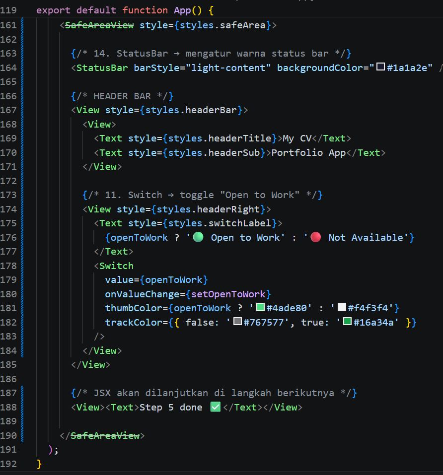

Langkah 6: ScrollView & Profil Section (View, Text, Image)
1. Menambahkan ScrollView sebagai wrapper konten CV agar bisa di-scroll
2. Menambahkan komponen Image untuk menampilkan foto profil dari URL menggunakan source={{ uri: PROFILE.avatar }}
3. Menambahkan conditional rendering badge "Open to Work" yang hanya muncul jika state openToWork bernilai true
4. Menampilkan data profil menggunakan komponen Text dengan berbagai ukuran dan weight
5. Menampilkan info kontak dalam baris horizontal menggunakan flexDirection: 'row'
6. Menambahkan tombol sosial media menggunakan TouchableOpacity yang menampilkan Alert saat ditekan
7. Menambahkan tombol Download CV menggunakan Pressable dengan efek visual berubah saat ditekan menggunakan state pressing
8. Konfirmasi Bukti
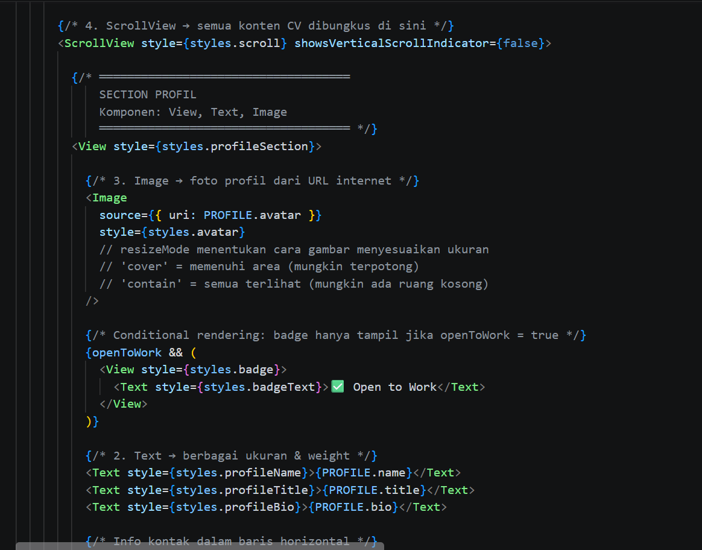

Langkah 7: FlatList (Daftar Skills)
1. Menambahkan section Keahlian di dalam ScrollView menggunakan View dengan style sectionBox
2. Menambahkan komponen FlatList dengan prop data={SKILLS} untuk menampilkan daftar skill secara efisien
3. Menggunakan keyExtractor untuk menghasilkan key unik tiap item
4. Menggunakan renderItem untuk memanggil komponen SkillCard pada setiap item
5. Menonaktifkan scroll FlatList dengan scrollEnabled={false} karena scroll sudah dihandle oleh ScrollView
6. Menambahkan ItemSeparatorComponent sebagai pemisah antar item skill
7. Konfirmasi Bukti
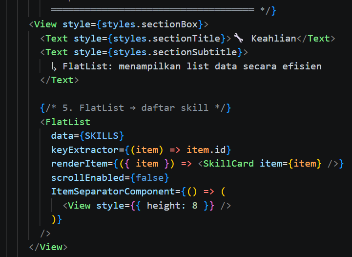

Langkah 8: SectionList (Pengalaman & Pendidikan)
1. Menambahkan section Riwayat di dalam ScrollView menggunakan View dengan style sectionBox
2. Menambahkan komponen SectionList dengan prop sections={SECTIONS} untuk menampilkan data yang dikelompokkan per kategori
3. Menggunakan renderItem untuk memanggil komponen TimelineCard dengan prop onPress={handleCardPress} agar modal terbuka saat kartu ditekan
4. Menambahkan renderSectionHeader untuk menampilkan judul tiap kelompok data
5. Menonaktifkan scroll SectionList dengan scrollEnabled={false}
6. Menambahkan ItemSeparatorComponent dan SectionSeparatorComponent sebagai pemisah antar item dan antar section
7. Konfirmasi Bukti
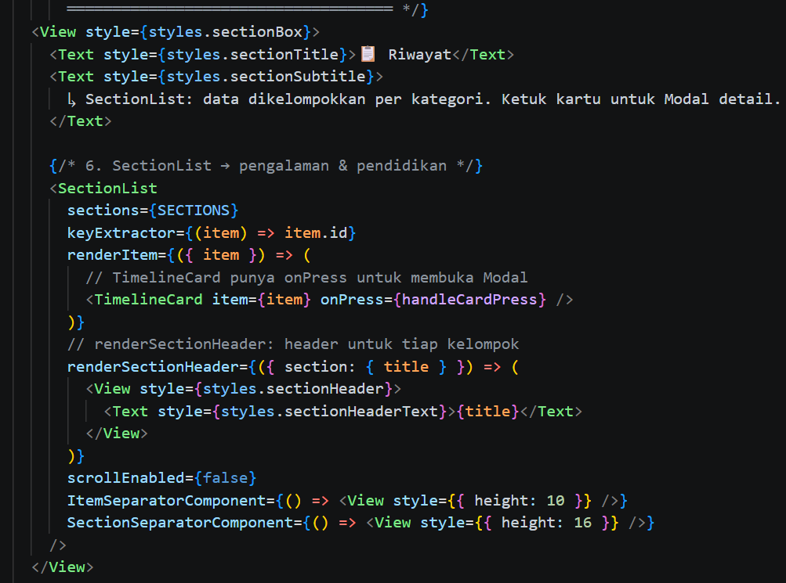

Langkah 9: TextInput, Button & ActivityIndicator
1. Menambahkan section Hubungi Saya di dalam ScrollView
2. Menambahkan TextInput pertama untuk input nama sebagai single line dengan value={senderName} dan onChangeText={setSenderName}
3. Menambahkan TextInput kedua untuk input pesan sebagai multiline dengan numberOfLines={4} dan textAlignVertical="top"
4. Kedua TextInput dinonaktifkan saat proses pengiriman dengan editable={!sending}
5. Menambahkan conditional rendering: jika sending bernilai true maka tampilkan ActivityIndicator, jika false tampilkan Button
6. ActivityIndicator ditampilkan dengan size="large" dan color="#7c3aed" beserta teks "Mengirim pesan..."
7. Button dengan title "Kirim Pesan" terhubung ke handler handleSend
8. Konfirmasi Bukti
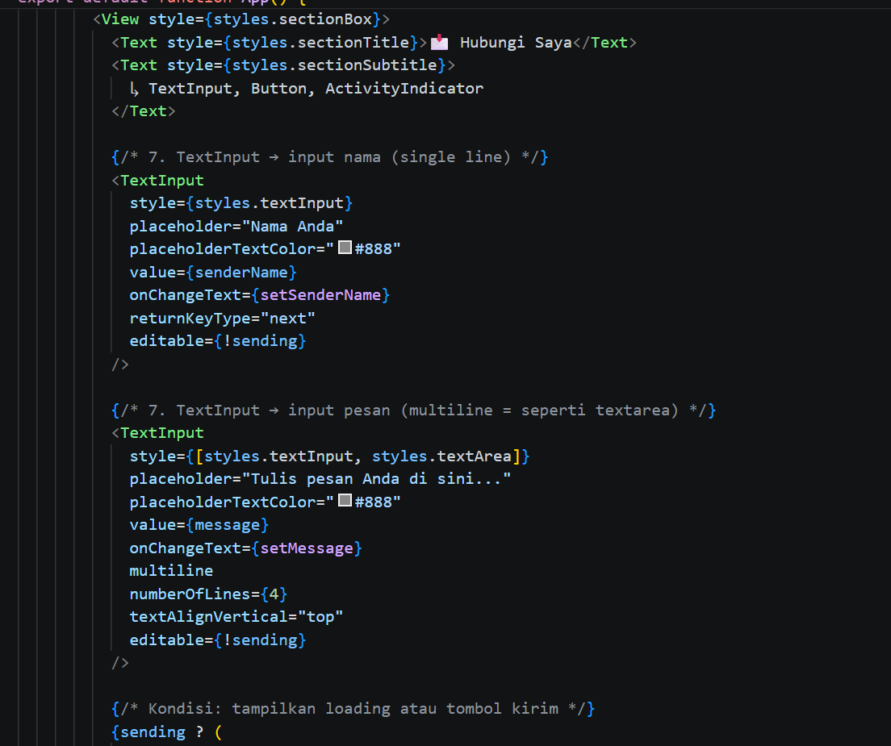

Langkah 10: Modal (Popup Detail)
1. Menambahkan komponen Modal setelah penutup </ScrollView> dan sebelum </SafeAreaView>
2. Mengatur prop visible={modalVisible} untuk mengontrol tampil/sembunyinya modal
3. Menggunakan animationType="slide" agar modal muncul dari bawah
4. Menggunakan transparent={true} agar latar belakang modal terlihat transparan gelap
5. Menambahkan onRequestClose untuk menangani tombol back pada Android
6. Membuat overlay gelap menggunakan View dengan style modalOverlay
7. Menampilkan detail item yang dipilih (role, company, period, desc) di dalam kotak dialog hanya jika selectedItem tidak null
8. Menambahkan tombol Tutup menggunakan TouchableOpacity yang memanggil setModalVisible(false)
9. Konfirmasi Bukti
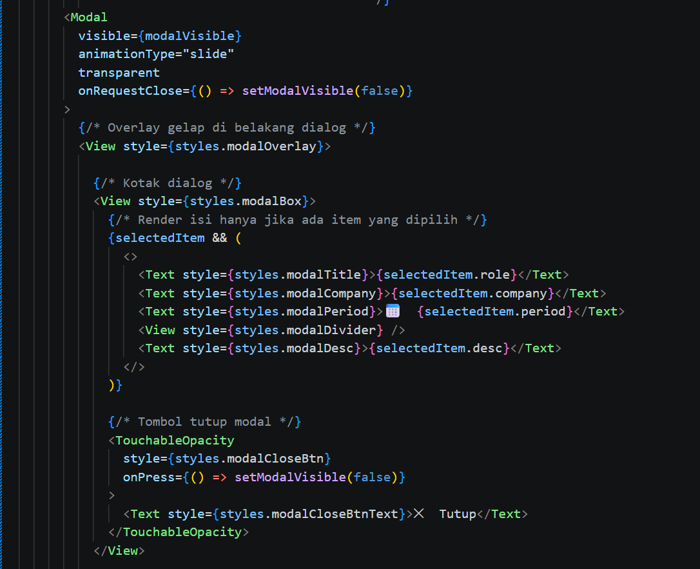

Langkah 11: StyleSheet (Styling Terpusat)
1. Membuat konstanta COLORS sebagai palet warna terpusat
2. Konfirmasi Bukti COLORS
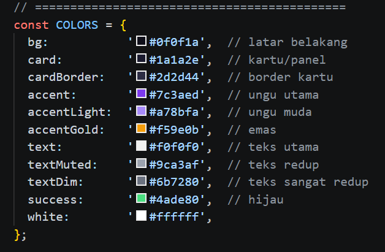
3. Membuat StyleSheet.create() sebagai pembuka styling terpusat
4. Konfirmasi Bukti StyleSheet.create
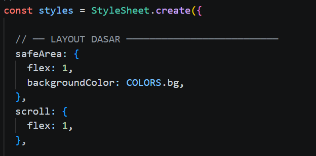
5. Mendefinisikan style headerBar dan switchRow untuk tampilan header
6. Konfirmasi Bukti Header Bar
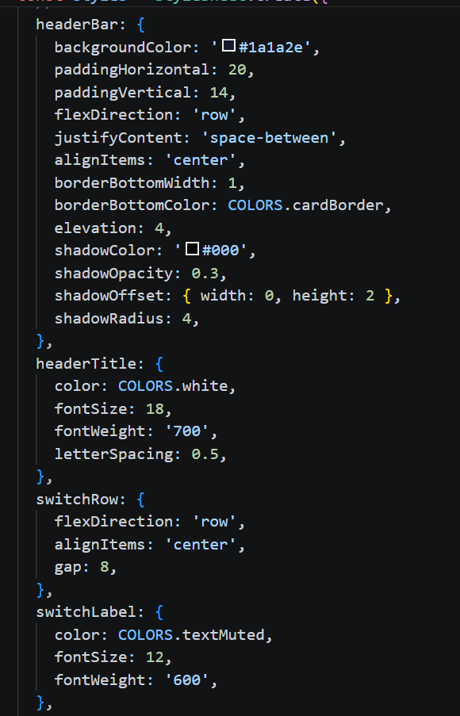
7. Mendefinisikan style profileSection, avatar, badge, profileName, profileTitle, profileBio, contactRow, dan contactItem
8. Konfirmasi Bukti Profile Section
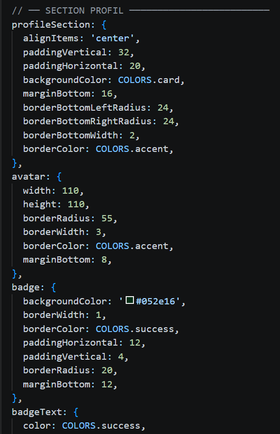
9. Mendefinisikan style socialRow, socialBtn, socialIcon, dan socialLabel untuk tombol sosial media
10. Konfirmasi Bukti Social Media
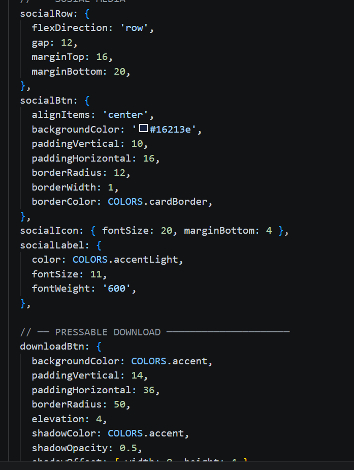
11. Mendefinisikan style downloadBtn, downloadBtnPressed, dan downloadBtnText untuk tombol Download CV
12. Konfirmasi Bukti Download Button
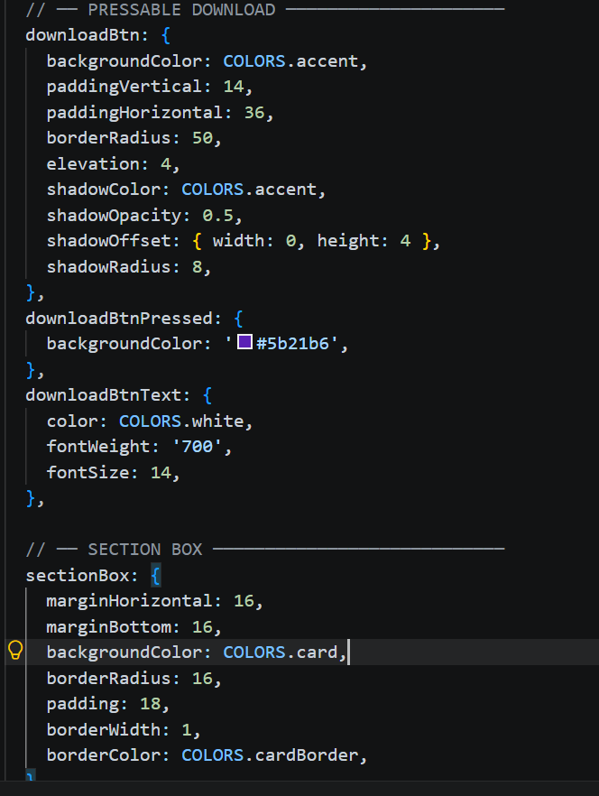
13. Mendefinisikan style sectionBox, sectionTitle, dan sectionSubtitle sebagai wrapper kartu section
14. Konfirmasi Bukti Section Box
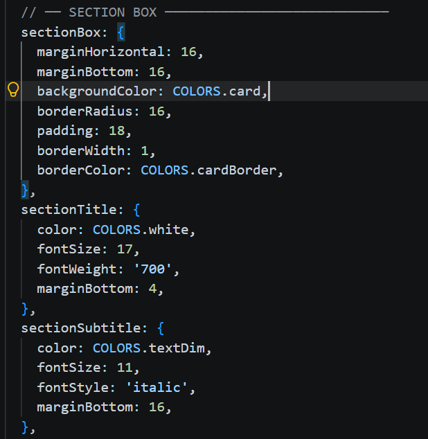
15. Mendefinisikan style sectionHeader dan sectionHeaderText untuk header tiap kelompok SectionList
16. Konfirmasi Bukti Section Header
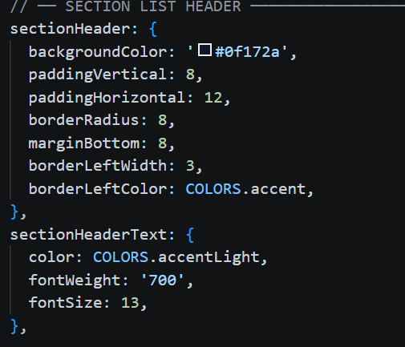
17. Mendefinisikan style skillCard, skillHeader, skillName, skillPercent, progressBg, dan progressFill untuk komponen SkillCard
18. Konfirmasi Bukti Skill Card
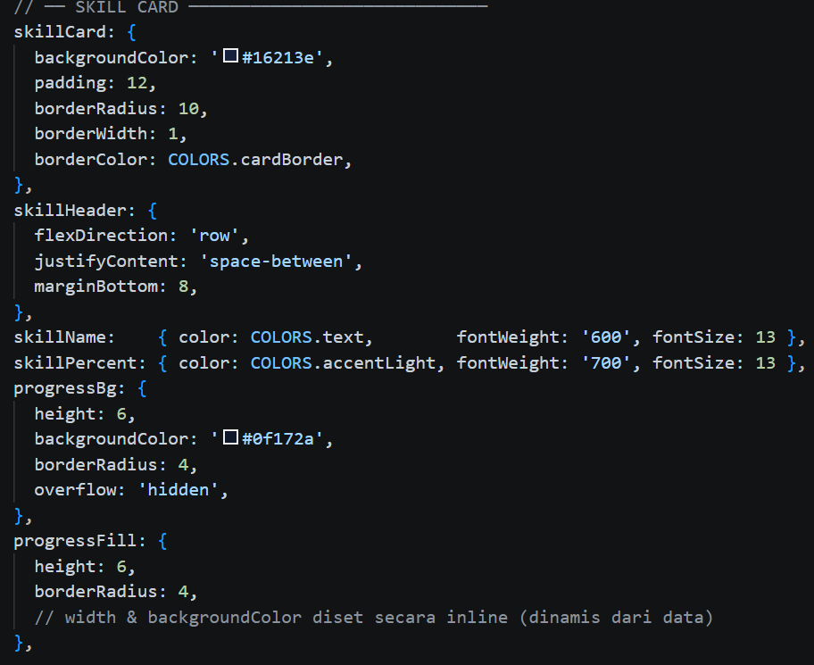
19. Mendefinisikan style timelineCard, timelineDot, timelineContent, timelineRole, timelineCompany, timelinePeriod, dan timelineHint untuk komponen TimelineCard
20. Konfirmasi Bukti Timeline Card
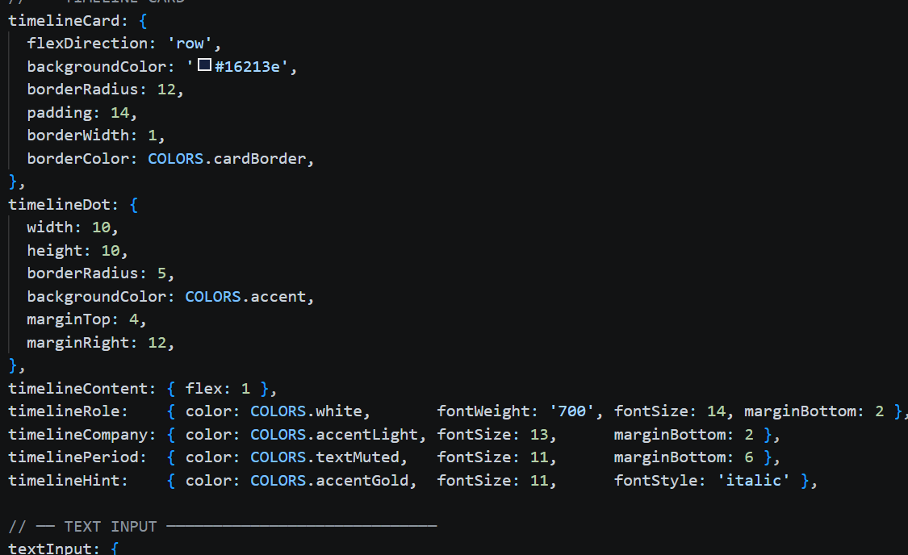
21. Mendefinisikan style textInput dan textArea dengan Platform.OS untuk menyesuaikan padding iOS dan Android
22. Konfirmasi Bukti Text Input
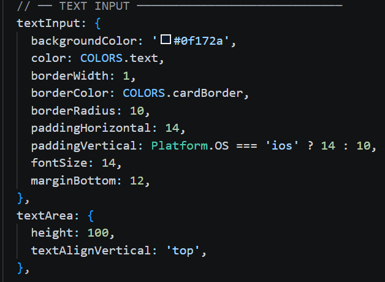
23. Mendefinisikan style loadingRow dan loadingText untuk tampilan loading
24. Konfirmasi Bukti Loading Row
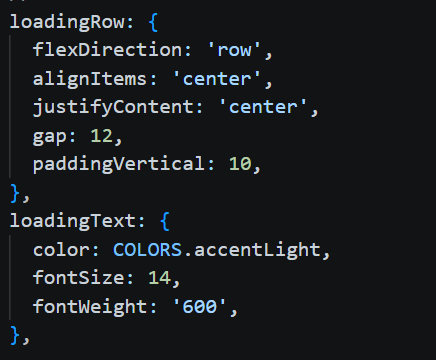
25. Mendefinisikan style modalOverlay, modalBox, dan semua style konten modal
26. Konfirmasi Bukti Modal
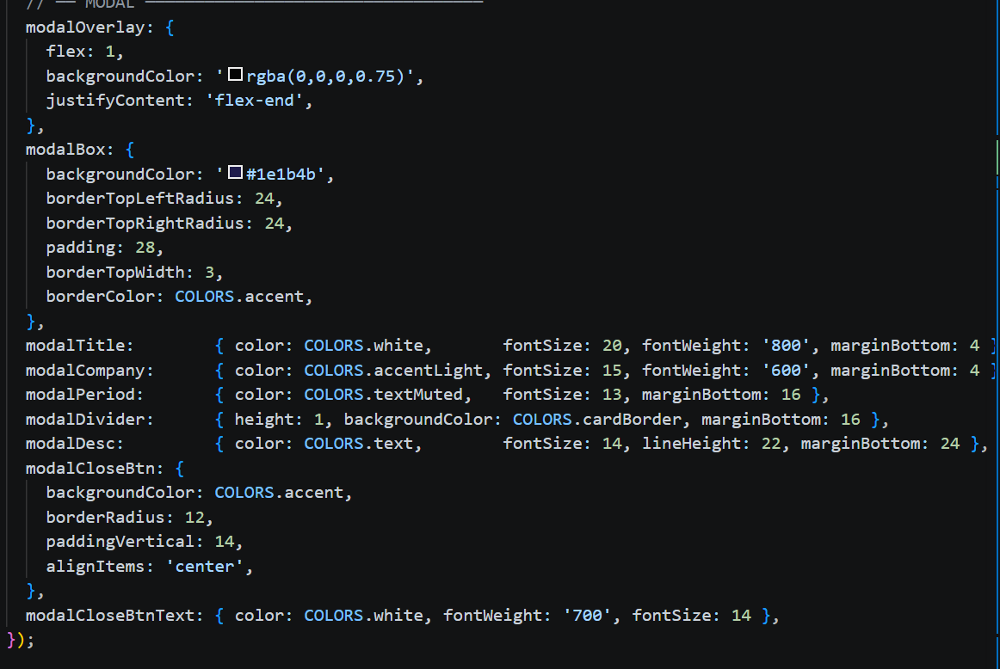

Langkah 12: Verifikasi & Pengujian
1. Jalankan aplikasi menggunakan perintah `npx expo start` lalu scan QR code menggunakan Expo Go di HP
2. Pastikan layar CV tampil tanpa error — seluruh section profil, skills, riwayat, dan form kontak terlihat
3. Scroll halaman dari atas ke bawah dan pastikan semua section dapat diakses tanpa masalah
4. Tap toggle Switch di pojok kanan header — badge "✅ Open to Work" harus muncul saat aktif dan hilang saat dimatikan
5. Lihat section Keahlian — setiap skill memiliki progress bar berwarna sesuai persentase yang didefinisikan di data SKILLS
6. Tap salah satu kartu di section Riwayat — Modal popup harus muncul slide dari bawah menampilkan detail role, company, period, dan deskripsi
7. Di dalam Modal, tap tombol "✕ Tutup" — Modal harus tertutup dan kembali ke tampilan utama
8. Isi form Hubungi Saya dengan nama dan pesan lalu tap "Kirim Pesan" — ActivityIndicator loading muncul selama 2 detik kemudian Alert sukses tampil
9. Tap "Kirim Pesan" tanpa mengisi form — Alert peringatan "Nama dan pesan tidak boleh kosong!" harus muncul
10. Tekan tombol "📥 Download CV (PDF)" — efek visual tombol berubah warna saat ditekan dan Alert "CV sedang diunduh..." muncul
11. Tap salah satu tombol sosial media (GitHub, LinkedIn, YouTube) — Alert menampilkan URL yang sesuai
12. Konfirmasi Bukti Demo Aplikasi (GIF)
