# MODUL PRAKTIKUM 4: Navigasi di React Native

Langkah 1 = Menginstall Dependesi dan Library yang dibutuhkan untuk membuat Navigasi
1. Install (npm install @react-navigation/native)
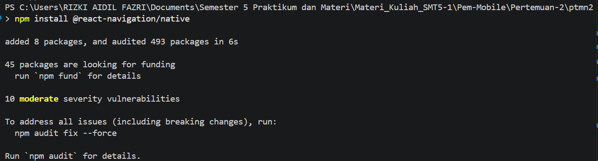
2. Install (npx expo install react-native-screens react-native-safe-area-context react-native-gesture-handler react-native-reanimated)
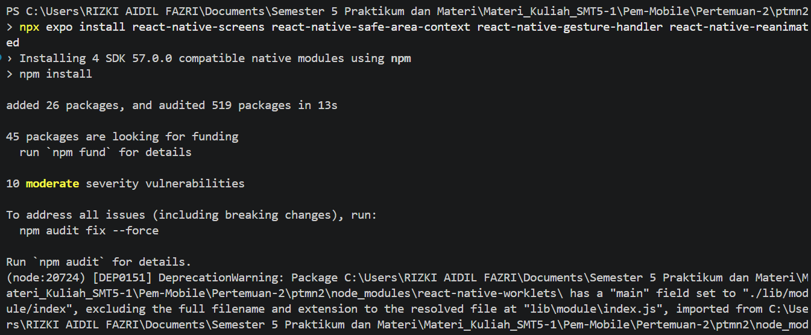

Langkah 2 = Membuat Stack Navigation
1. Instalasi Pustaka Stack (npm install @react-navigation/native-stack)
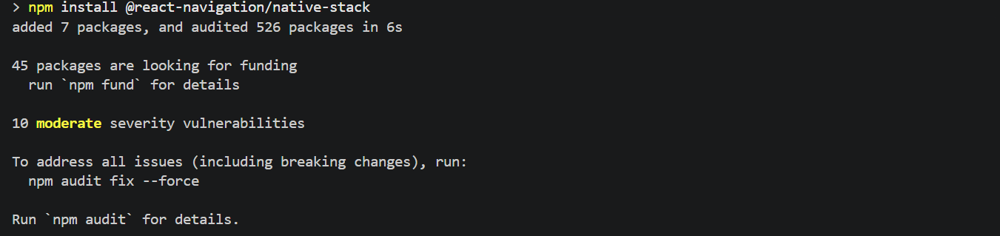
2. Tambahkan Parameter navigation didalam app.js
3. Buat folder baru bernama screens di dalam root project untuk menyimpan file-file antarmuka.
4. Buat dua file baru di dalam folder screens Login.js dan Signup.js
5. Isi file screens/Login.js dengan kode dari modul.
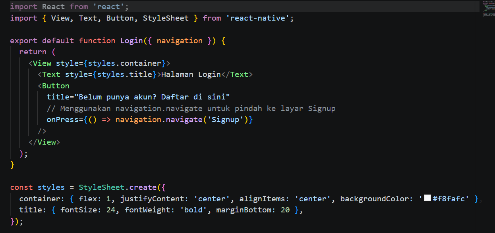
6. Isi file screens/Signup.js dengan kode dari modul.
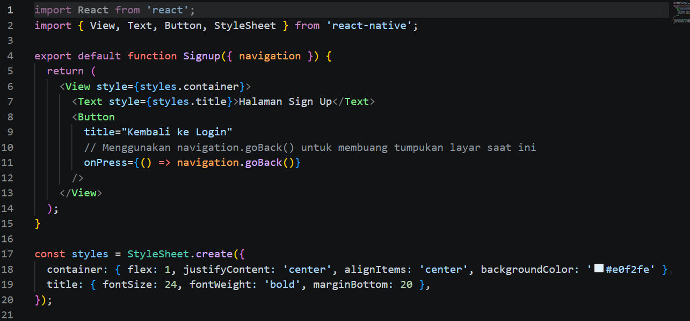
7. Konfigurasi Stack Navigator di App.js
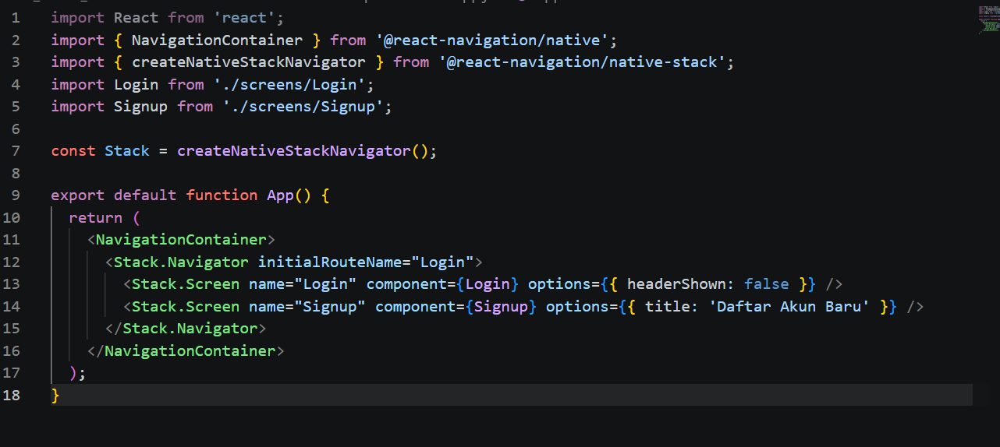
8. Bukti Stack Navigator
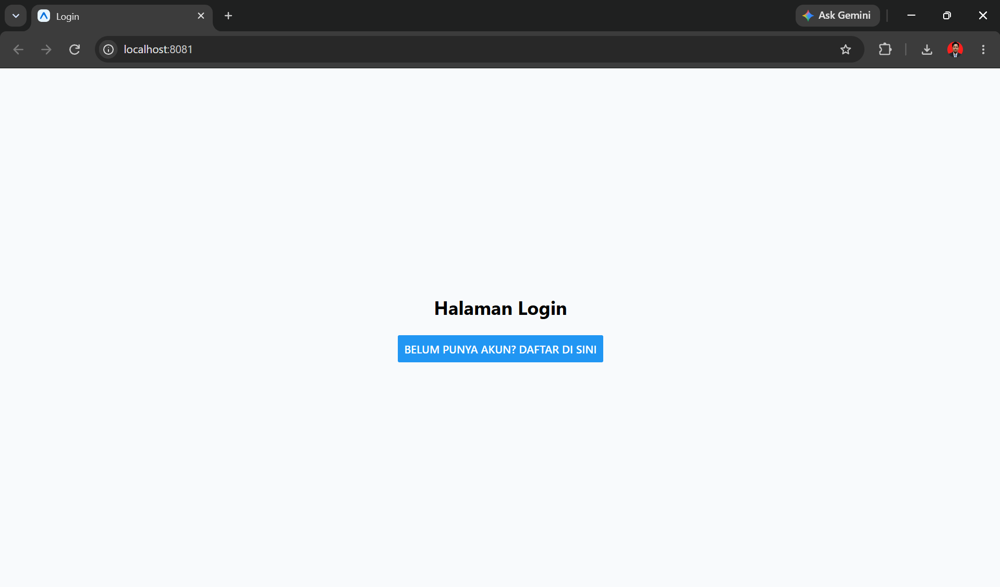
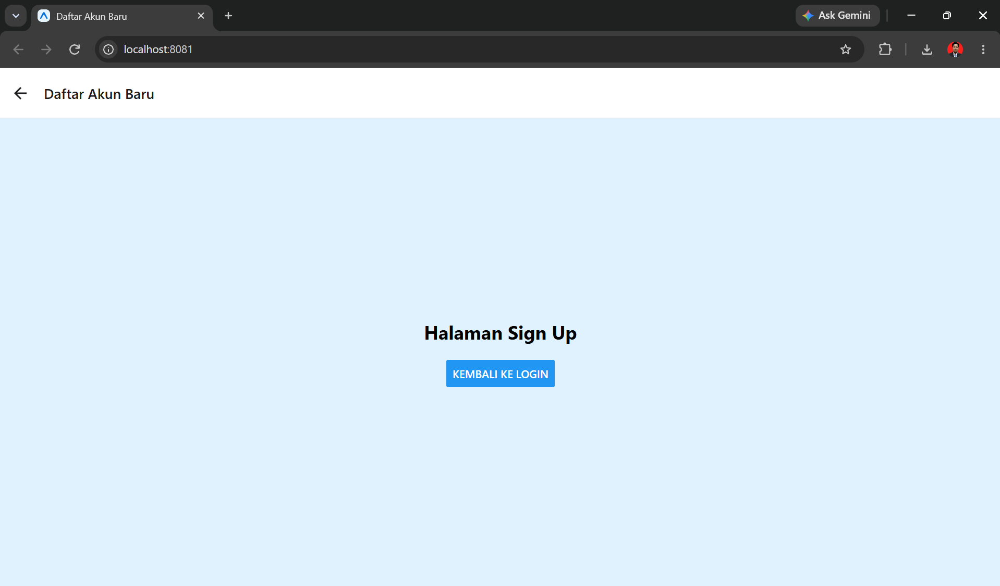
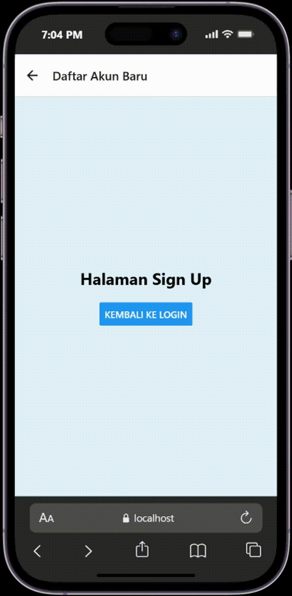

Langkah 3 = Membuat Bottom Tab Navigation
1. Instalasi Pustaka Bottom Tabs (npm install @react-navigation/bottom-tabs)
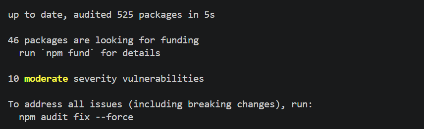
2. Isi file screens/HomeScreen.js dengan kode dari modul.
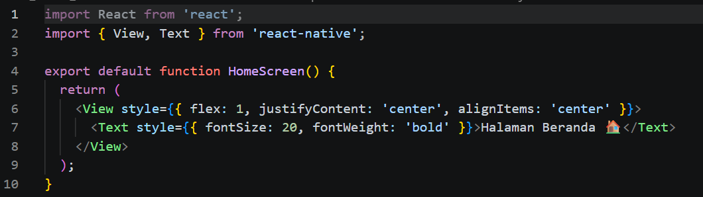
3. Isi file screens/ProfileScreen.js dengan kode dari modul.
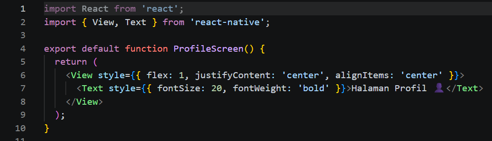
4. Konfigurasi Tab Navigator di App.js
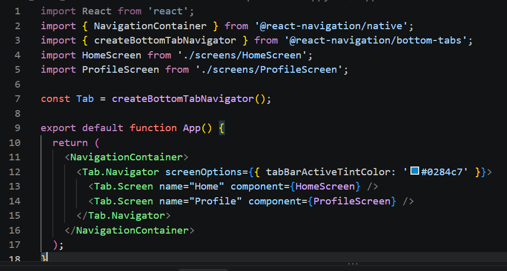
5. Bukti Tab Navigator
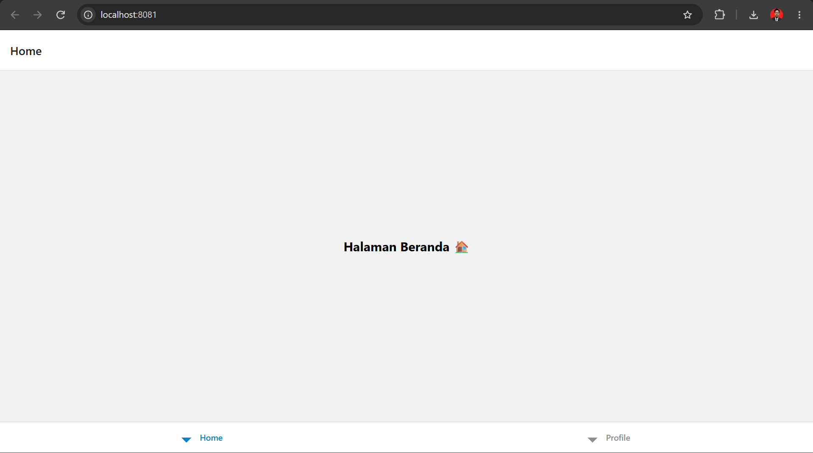
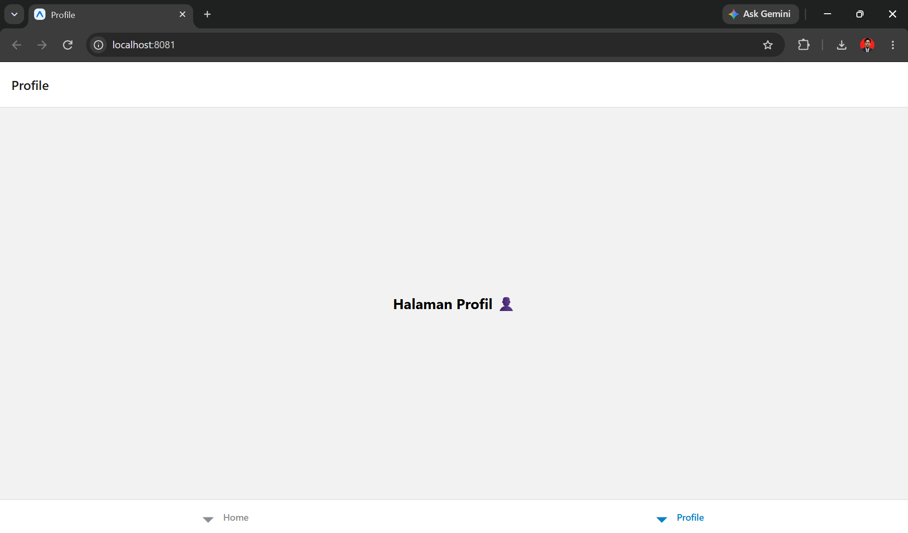
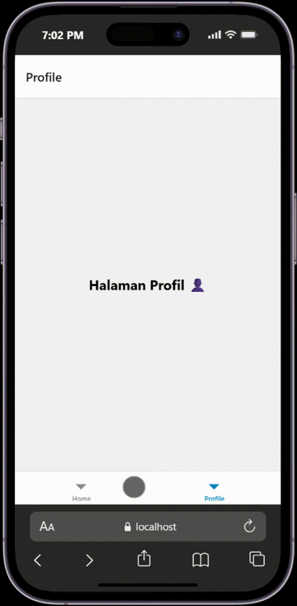

Langkah 4 = Membuat Drawer Navigation
1. Instalasi Pustaka Drawer (npm install @react-navigation/drawer)
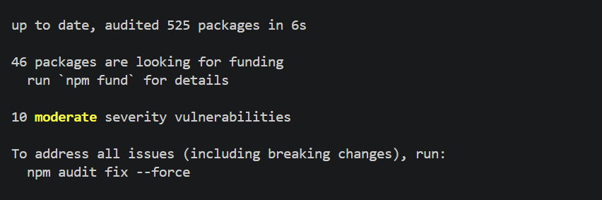
2. Konfigurasi Drawer Navigator di App.js
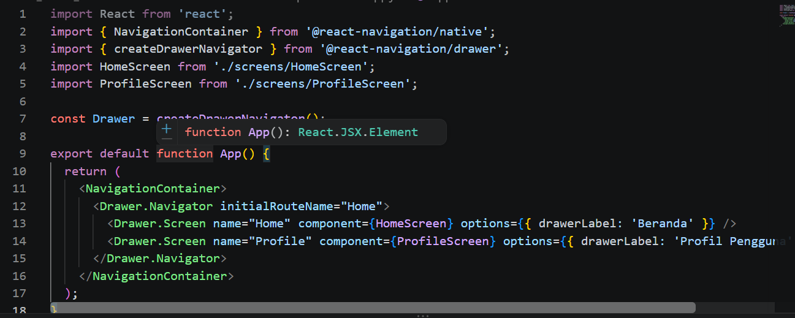
3. Bukti Drawer Navigator
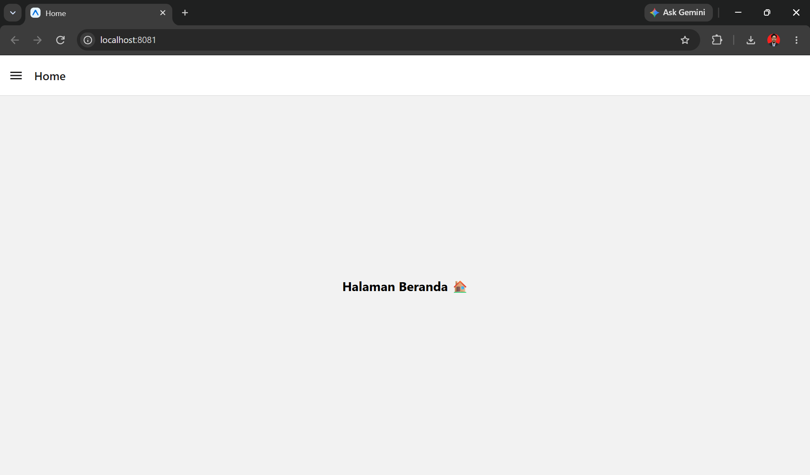
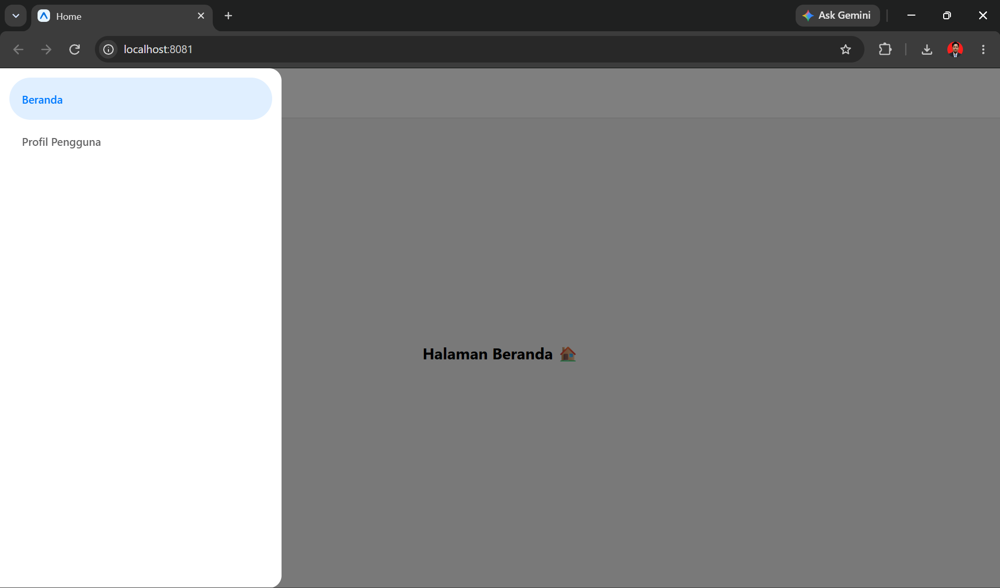
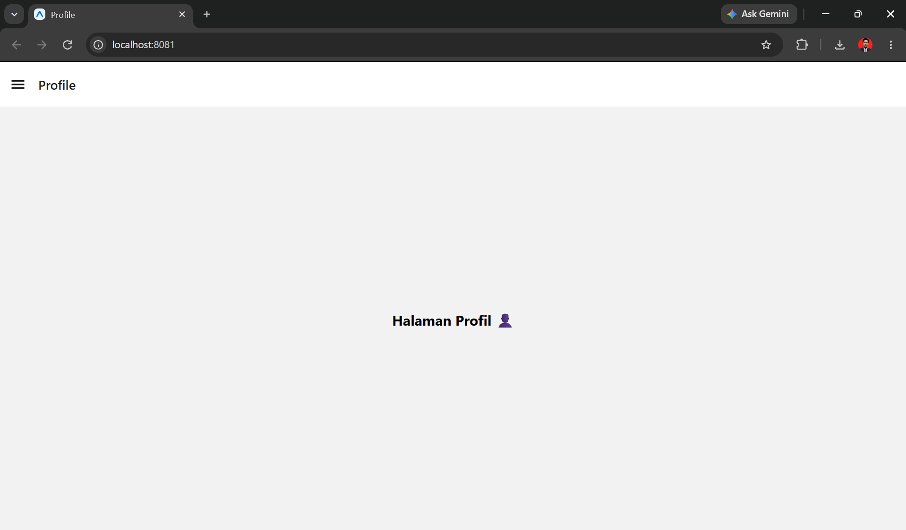
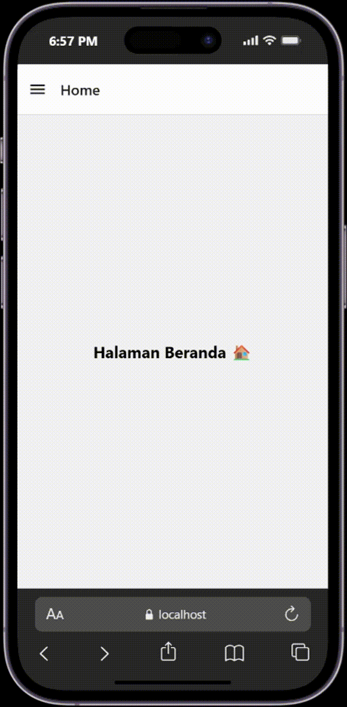